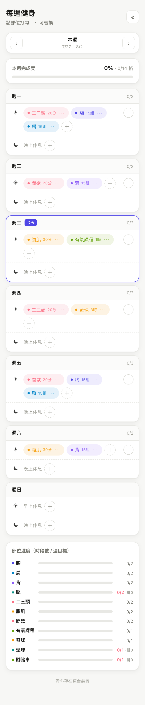
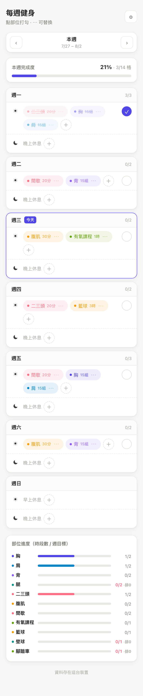
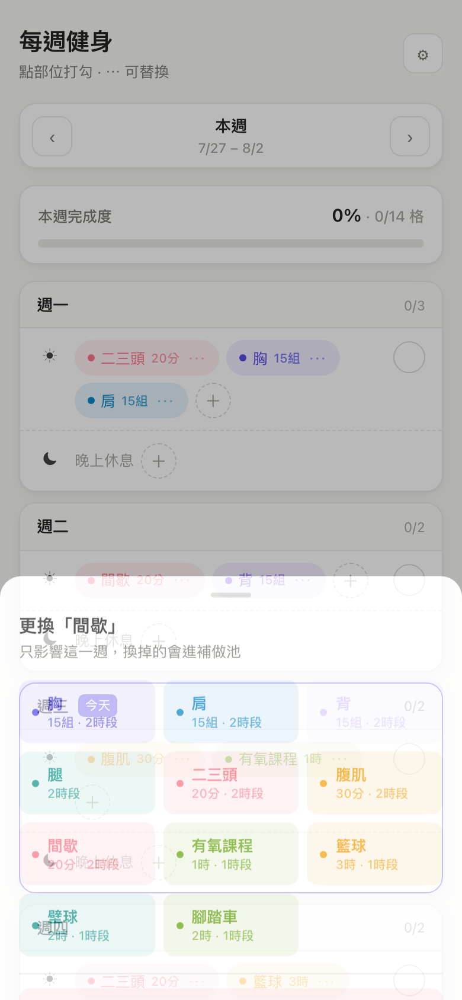
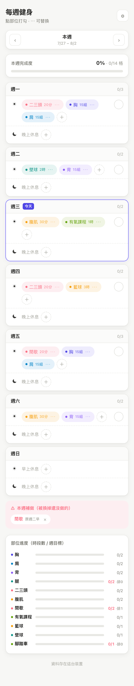
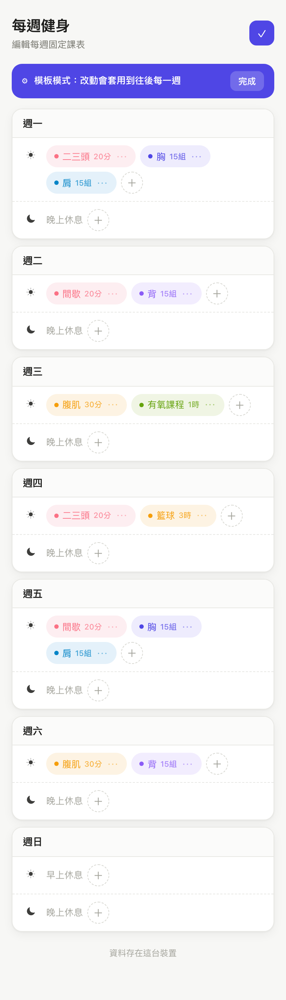
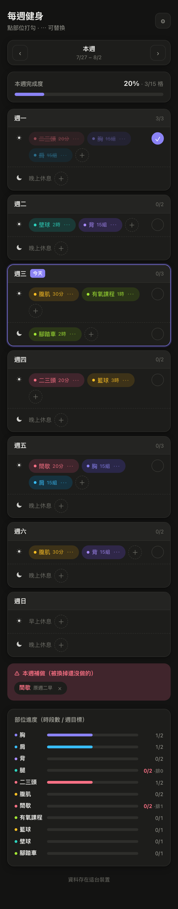

# 每週健身

一頁式的每週健身打勾紀錄。7 天 × 早／晚時段，點一下就打勾，排錯了可以當週替換或直接改模板。

**線上版：https://work.yanchen.app/**



## 為什麼是這樣設計

每週有固定的訓練配額（胸 15 組兩個時段、籃球 3 小時一個時段…共 11 項），
但實際哪天做哪項會變。所以：

- **課表是可變的**，不是寫死的。預設的早上課表只是起點，隨時可以改。
- **只打勾，不記組數**。做了就是做了，不需要在健身房裡輸入數字。
- **換掉沒做的東西不會憑空消失**，會進「本週補做」，提醒這週還欠什麼。

## 功能

| 功能 | 說明 |
|---|---|
| 打勾 | 點部位就標記完成；每個時段右邊的 ✓ 可一次打勾整段 |
| 單週替換 | 點 `⋯` 換成別的部位，**只影響這一週** |
| 補做池 | 被換掉／移除但**還沒打勾**的項目會進補做池；已打勾的不會（已經做過了） |
| 模板編輯 | 右上 ⚙ 進模板模式，改動**套用到往後每一週** |
| 週切換 | `‹ ›` 看前後幾週，每週資料各自獨立 |
| 部位進度 | 11 項各自的「已完成時段數 / 週目標」，排不夠的標紅 |
| 三個帳號 | 首次開啟選 `bob` / `user1` / `user2`，選過就記住；頁尾有小小的登出可換人 |
| 跨裝置同步 | 同一個帳號在手機與電腦看到同一份資料（Firestore） |
| 離線可用 | 資料先寫本機，雲端連不上照樣完整可用 |

## 畫面

| 打勾後 | 替換選單 | 補做池 |
|---|---|---|
|  |  |  |

| 模板模式 | 深色模式 |
|---|---|
|  |  |

## 每週配額

| 部位 | 目標 | 時段數 |
|---|---|---|
| 胸 / 肩 / 背 | 15 組 | 2 |
| 腿 | — | 2 |
| 二三頭 | 20 分鐘 | 2 |
| 腹肌 | 30 分鐘 | 2 |
| 間歇 | 20 分鐘 | 2 |
| 有氧課程 | 1 小時 | 1 |
| 籃球 | 3 小時 | 1 |
| 壁球 | 2 小時 | 1 |
| 腳踏車 | 2 小時 | 1 |

預設早上課表：一 二三頭/胸/肩 · 二 間歇/背 · 三 腹肌/有氧課程 ·
四 二三頭/籃球 · 五 間歇/胸/肩 · 六 腹肌/背。晚上時段預設留空，自己排。

## 開發

```bash
npm install
npm run dev      # http://localhost:5173
npm test         # 54 個測試
npm run build
```

### 帳號與 Firebase

只有三個固定帳號 `bob` / `user1` / `user2`，**沒有密碼、沒有登入驗證**。
首次開啟選一個，選擇存在 localStorage，之後開啟直接進；頁尾有小小的「登出」可換人。
帳號只決定資料存在雲端哪一格（`users/{bob|user1|user2}`），不是安全邊界。

**這是刻意的取捨**：換來手機與電腦開同一網址就同步，代價是知道 Firebase 專案 ID 的人
也能讀寫這三格。`firestore.rules` 因此把可寫範圍鎖死在這三個 uid 的
`weeks/{weekKey}` 與 `meta/template` 兩種路徑，其他一律拒絕，避免被當成公開資料庫亂寫。
存的是健身打勾紀錄，沒有個資。要真正的存取控制就得加回 Google 登入。

沒設定 Firebase 也能跑，資料存在瀏覽器 localStorage（就是沒有跨裝置同步）。
要同步需設定 `VITE_FIREBASE_API_KEY`、`VITE_FIREBASE_AUTH_DOMAIN`、
`VITE_FIREBASE_PROJECT_ID`、`VITE_FIREBASE_APP_ID`（寫在 `.env.local`，不進版控）。

頁尾的「資料已同步雲端／資料存在這台裝置」看的是**真的讀寫過 Firestore 沒有**，
不是「設定有沒有填」——雲端掛掉時它會誠實變回「資料存在這台裝置」，功能不受影響。

安全規則改動後重新部署：

```bash
firebase deploy --only firestore:rules --project work-out-yc
```

## 結構

```
src/
├── domain/          # 純函式：週次計算、打勾、替換、補做池、進度
│   ├── types.ts
│   ├── catalog.ts   # 11 個部位與預設課表
│   ├── week.ts
│   └── week.test.ts
├── lib/
│   ├── firebase.ts  # Firestore 初始化 + 三個固定帳號
│   ├── store.ts     # 本機優先，雲端次之
│   └── useWorkout.ts
├── App.tsx
└── App.test.tsx     # 使用者流程測試
```

所有狀態變更都是不可變的——`domain/` 裡的函式一律回傳新物件，不改參數。

## 測試

54 個測試，分兩層：

- `domain/week.test.ts` — 週次邊界（跨年 ISO 週）、打勾、替換的補做池規則、進度計算
- `App.test.tsx` — 真實點擊流程：打勾、整段打勾、替換、新增、週切換、模板套用、
  選人／記住／登出、不同帳號資料隔離，以及「雲端沒真的連上時，頁尾不能謊稱已同步」

瀏覽器端另外跑過 25 項 round-trip（含破版、深色模式、320px 窄螢幕、
重新整理後資料保留），以及 10 項跨裝置同步驗證：用兩個獨立的瀏覽器 context
（各自空的 localStorage = 兩台裝置）互相確認打勾真的傳得過去、傳得回來，
且 `user2` 的改動不會污染 `bob`。
