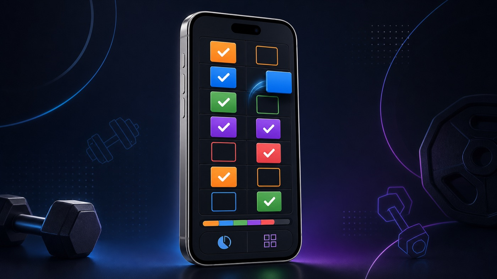
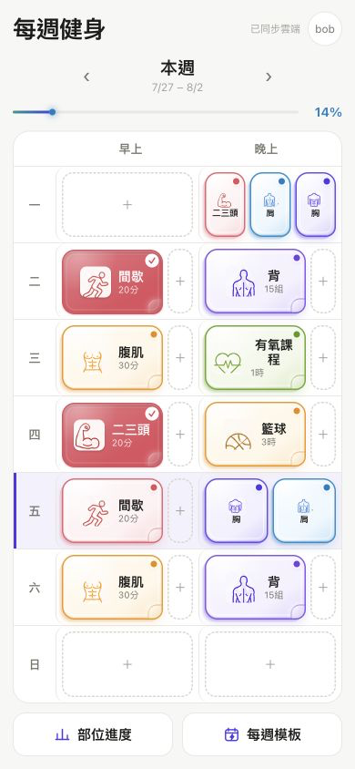
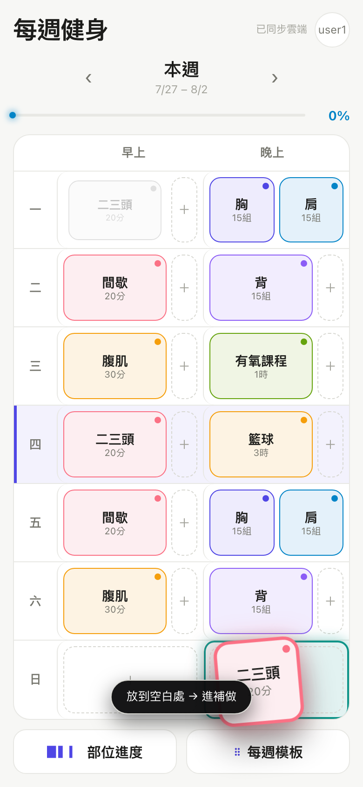
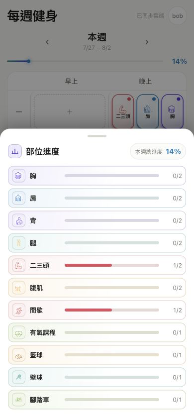
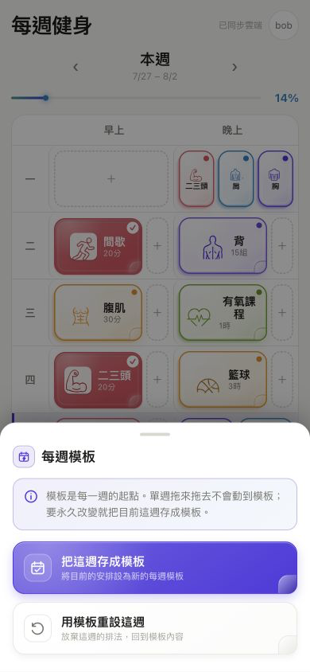

# 每週健身



一頁式的每週健身打勾紀錄。7 天 × 早／晚時段一屏看完，點一下就打勾，
排錯了就把方塊**拿起來換位置**。11 種訓練各有專屬圖騰與色彩，一眼就能找到；
可以加到 iPhone 主畫面當 app 用，離線照樣打勾。

**線上版：https://work.yanchen.app/**

實際畫面：



## 為什麼是這樣設計

每週有固定的訓練配額（胸 15 組兩個時段、籃球 3 小時一個時段…共 11 項），
但實際哪天做哪項會變。所以：

- **課表是可變的**，不是寫死的。預設模板只是起點，隨時可以改。
- **只打勾，不記組數**。做了就是做了，不需要在健身房裡輸入數字。
- **換掉沒做的東西不會憑空消失**，會進「本週補做」，提醒這週還欠什麼。
- **手機優先**。一屏看完整週，不用捲；拖曳走 pointer events，
  iOS Safari 上真的能用（HTML5 drag-and-drop 在觸控上根本不會觸發）。
- **圖騰比文字更快辨識**。胸、背、跑步間歇、球類等 11 種項目都有自己的線性圖騰；
  仍保留名稱和份量，不靠顏色猜內容。

## 功能

| 功能 | 說明 |
|---|---|
| 打勾 | 點方塊就標記完成 |
| 拖曳換位置 | 長按 0.18 秒把方塊「拿起來」，放到別格就換位置；放到空白處進補做池 |
| 補做池 | 被換掉／移除但**還沒打勾**的項目會進補做池；已打勾的不會（已經做過了） |
| 部位進度 | 底部拉盤：11 項各自的「已完成時段數 / 週目標」 |
| 每週模板 | 底部拉盤：把本週存成模板，或用模板重設本週。改模板**套用到往後每一週** |
| 週切換 | `‹ ›` 看前後幾週，每週資料各自獨立 |
| 三個帳號 | 首次開啟選 `bob` / `user1` / `user2`，選過就記住；頁尾有小小的登出可換人 |
| 跨裝置同步 | 同一個帳號在手機與電腦看到同一份資料（Firestore） |
| 離線可用 | 資料先寫本機，雲端連不上照樣完整可用；欠的同步記在佇列裡，回線或下次開啟自動補送 |
| 加到主畫面 | PWA：Safari 分享 → 加入主畫面，全螢幕、沒有網址列、離線可開 |
| 鍵盤可用 | Tab 走到方塊、Enter／空白鍵打勾；拉盤按 Esc 關閉，焦點會關進拉盤裡再還回原按鈕 |

## 畫面

| 拿起來放下去 | 部位進度 | 每週模板 |
|---|---|---|
|  |  |  |

## 裝到 iPhone

**沒有原生 app、不用上 App Store**。用 Safari 開 https://work.yanchen.app/ →
分享 → **加入主畫面**。之後從主畫面點開就是全螢幕、沒有網址列，離線也打得開。

離線之所以成立，是因為 `localStorage` 本來就是 source of truth，雲端只是同步層。
Service worker（Workbox）只預快取 JS/CSS/HTML，Firestore 一律走網路不快取——
快取住反而會讀到舊資料。

離線期間的改動會記進待同步佇列（存在 `localStorage`，關掉 app 也還在），
回線、頁面重新可見、或下次開啟時自動補送。**注意**：離線改完就關掉 app，
那筆是靠「這台裝置下次開啟」補送的——關頁當下沒網路，物理上送不出去。
這台永遠不再開的話，改動就只留在這台本機。這是離線優先架構的固有限制。

兩台同時離線、各打各的勾時，上雲一律是 **read-merge-write**：先讀回雲端現況再合併，
`checked` 取聯集，兩台的勾都留著。之前是整份 last-write-wins，後同步的那台會把先同步的
整份蓋掉——實測重現過，勾就這樣消失。代價是「取消打勾」可能被另一台的舊資料復活；
漏掉真的做過的訓練，比多出一個可以再點掉的勾嚴重得多。

### 載入速度

Firebase 佔整包的 68%（gzip 138 KB），但第一屏根本用不到它——`localStorage`
才是 source of truth。所以 Firestore 改成**用到才動態載入**，主 chunk 從
gzip 204.8 KB 降到 68.6 KB（少 66%）。

開頁時先同步讀 `localStorage` 把畫面撐起來，雲端版本晚點回來再覆蓋。
實測（把那個 chunk 的回應故意卡 6 秒）：格線仍在 **+79ms** 出現、14 個方塊都在。
那個 chunk 還是會在 +28ms 被平行抓下來，但那是「同時下載」不是「擋著繪製」。

## 每週配額

| 部位 | 目標 | 時段數 |
|---|---|---|
| 胸 / 肩 / 背 | 15 組 | 2 |
| 腿 | — | 2 |
| 二三頭 | 20 分鐘 | 2 |
| 腹肌 | 30 分鐘 | 2 |
| 間歇 | 20 分鐘 | 2 |
| 有氧課程 | 1 小時 | 1 |
| 籃球 | 3 小時 | 1 |
| 壁球 | 2 小時 | 1 |
| 腳踏車 | 2 小時 | 1 |

預設模板是**一天一早一晚**：一 二三頭／胸·肩 · 二 間歇／背 · 三 腹肌／有氧課程 ·
四 二三頭／籃球 · 五 間歇／胸·肩 · 六 腹肌／背 · 日 休。

## 開發

**Node 22.12.0**（版本寫在 `.nvmrc`，CI 也讀同一個檔）。用 nvm 的話 `nvm use` 就會切好。
`package.json` 的 `engines` 允許 `>=22.12.0 <25`，22 與 24 都實測跑得起來。

```bash
nvm use          # 讀 .nvmrc
npm install
npm run dev      # http://localhost:5173
npm test         # 138 個測試
npm run build
```

### 帳號與 Firebase

只有三個固定帳號 `bob` / `user1` / `user2`，**沒有密碼、沒有登入驗證**。
首次開啟選一個，選擇存在 localStorage，之後開啟直接進；頁尾有小小的「登出」可換人。
帳號只決定資料存在雲端哪一格（`users/{bob|user1|user2}`），不是安全邊界。

**這是刻意的取捨**：換來手機與電腦開同一網址就同步，代價是知道 Firebase 專案 ID 的人
也能讀寫這三格。`firestore.rules` 因此把可寫範圍鎖死在這三個 uid 的
`weeks/{weekKey}` 與 `meta/template` 兩種路徑，其他一律拒絕，避免被當成公開資料庫亂寫。
存的是健身打勾紀錄，沒有個資。要真正的存取控制就得加回 Google 登入。

沒設定 Firebase 也能跑，資料存在瀏覽器 localStorage（就是沒有跨裝置同步）。
要同步需設定 `VITE_FIREBASE_API_KEY`、`VITE_FIREBASE_AUTH_DOMAIN`、
`VITE_FIREBASE_PROJECT_ID`、`VITE_FIREBASE_APP_ID`（寫在 `.env.local`，不進版控）。

頁尾的「資料已同步雲端／資料存在這台裝置」看的是**真的讀寫過 Firestore 沒有**，
不是「設定有沒有填」——雲端掛掉時它會誠實變回「資料存在這台裝置」，功能不受影響。

安全規則改動後重新部署：

```bash
firebase deploy --only firestore:rules --project work-out-yc
```

## 結構

```
src/
├── domain/          # 純函式：週次計算、打勾、替換、補做池、進度
│   ├── types.ts
│   ├── catalog.ts   # 11 個部位與預設模板
│   ├── week.ts
│   └── week.test.ts
├── lib/
│   ├── firebase.ts  # Firestore 初始化 + 三個固定帳號
│   ├── store.ts     # 本機優先，雲端次之；上雲一律 read-merge-write
│   ├── store.test.ts
│   ├── schema.ts    # 雲端／本機資料讀入前的型別守衛
│   ├── syncQueue.ts # 離線待同步佇列（write-ahead）
│   ├── useDrag.ts   # pointer events 拖曳（長按拿起、移動取消）
│   └── useWorkout.ts
├── App.tsx
└── App.test.tsx     # 使用者流程測試
```

所有狀態變更都是不可變的——`domain/` 裡的函式一律回傳新物件，不改參數。

## 測試

138 個測試：

- `domain/week.test.ts` — 週次邊界（跨年 ISO 週）、打勾、替換的補做池規則、進度計算
- `lib/syncQueue.test.ts` — 佇列去重、送達才移除、送出期間又改動、部分失敗、併發 flush
- `lib/store.test.ts` — 雲端寫失敗留佇列、回線補送、補送前先合併、讀失敗退回本機、
  雲端髒資料不採用（用假的 Firestore，可指定第幾次讀／寫爆掉）
- `lib/schema.test.ts` — 型別守衛：缺天／缺時段／混型別／半截文件／欄位越界
- `App.test.tsx` — 真實點擊流程：打勾、拖曳換位置、補做池、週切換、模板存取、
  選人／記住／登出、不同帳號資料隔離，以及「雲端沒真的連上時，頁尾不能謊稱已同步」
- `App.test.tsx`（鍵盤與 dialog）— Enter／空白鍵打勾、拉盤 Esc 關閉、焦點移入與還原、
  Tab 不會逃出拉盤

瀏覽器端另外跑過真實 round-trip：22 項手機版視覺與互動（含破版、固定淺色模式、
320px 窄螢幕、重新整理後資料保留）、15 項線上版 PWA 驗收（加到主畫面、
service worker 預快取、斷網後照樣打勾），以及跨裝置同步驗證：用兩個獨立的
瀏覽器 context（各自空的 localStorage = 兩台裝置）互相確認打勾真的傳得過去、
傳得回來，且 `user2` 的改動不會污染 `bob`。

離線同步另外實測兩條路徑：**離線改 → 關掉 app → 重開補送 → 另一台讀到**，
以及 **離線改 → 回線補送 → 另一台讀到**，兩條都從另一台裝置的畫面確認收到。
（實測發現：離線時 `setDoc` 不會 reject，Firestore SDK 把它收進記憶體緩衝，
所以「失敗才記帳」的寫法是死碼——佇列必須在送出前就記帳。）

專案狀態頁：https://html.yanchen.app/work-out/
